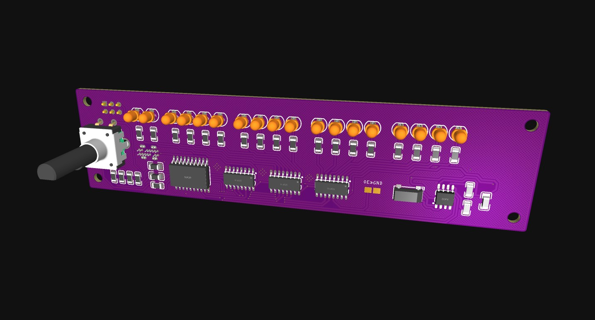

# UnBin | Unreadable Binary Clock v1.0.0b

Shows the time in a binary way.
But unreadable for humans.

## PCB


## Example
`00:10:01 ===   1001 ===          0011 11101001`

`19:50:50 === 195050 === 0010 11111001 11101010`

`23:59:59 === 235959 === 0011 10011001 10110111`

---

Copyright (c) 2022 Thomas Meschke

MIT License
https://opensource.org/licenses/mit-license.php

## Important note:


## Libraries


## Schematic


## Some binary examples

```
     1 ===               00000001
     2 ===               00000010
     3 ===               00000011
   255 ===               11111111
  1000 ===          0011 11101000
  1001 ===          0011 11101001
 10000 ===      00100111 00010000
195050 === 0010 11111001 11101010
235858 === 0011 10011001 01010010
235959 === 0011 10011001 10110111
```
